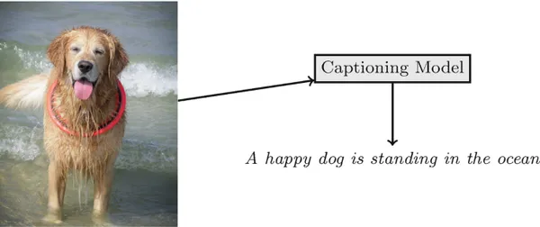

# Describing the World: Image Captioning with CNN-LSTM and Transformer Models

This project explores the intersection of computer vision and natural language processing through the task of **image captioning** — automatically generating natural language descriptions for images. We experiment with two deep learning approaches: a traditional **CNN + LSTM** model and a modern **Transformer-based** model. The Flickr8k dataset is used for training and evaluation.

---

## Project Objectives

* Implement an image captioning system using:

  * CNN + LSTM architecture
  * Transformer architecture
* Compare model performances using BLEU scores and generated captions
* Explore how deep learning models can understand and describe visual content

---

## Dataset

The Flickr8k dataset consists of 8,000 images, each annotated with five human-written captions. The dataset can be requested from the University of Illinois.

---

## Model Architectures

1. **CNN + LSTM**

   * **Encoder**: A pre-trained CNN (like InceptionV3) is used to extract visual features from the image.
   * **Decoder**: An LSTM network generates captions word-by-word using the image features and previously generated words.

2. **Transformer**

   * **Encoder**: A pre-trained CNN extracts features, which are passed through dense layers.
   * **Decoder**: A Transformer decoder processes tokenized captions, using attention mechanisms to align text with image features.
   * Uses self-attention, cross-attention, and positional encoding.

---

## Evaluation

We use BLEU scores (BLEU-1 to BLEU-4) to evaluate the similarity between generated captions and reference human captions. We also perform a qualitative comparison to inspect how well the models describe different images.

---

## Key Concepts Covered

* Image feature extraction using CNNs
* Sequence generation using LSTMs and Transformers
* BLEU score evaluation
* Teacher forcing and greedy decoding
* Positional encoding and attention mechanisms

---

## Example Output

Image: \[Image of a dog running]
CNN-LSTM Caption: "A dog is running in the field."
Transformer Caption: "A dog is playing in the grass."

---

## Credits and Acknowledgments

* Flickr8k dataset – University of Illinois
* TensorFlow, Keras, and PyTorch communities
* Inspiration from “Show and Tell: A Neural Image Caption Generator” and “Attention is All You Need” papers

---

## Author

Created by Amira Boudaoud
contributors : Ghofrane ben Rhaeim 

